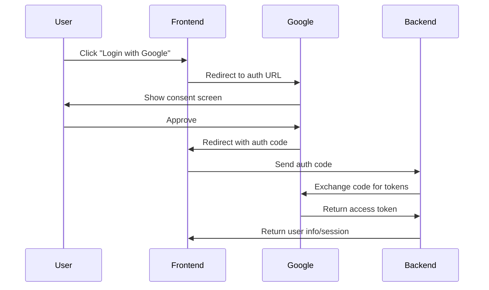

<!-- # 📖 My Personal Notes – OAuth & Social Login Implementation -->

OAuth confused me for ages until I realized it's just a way to let users say "hey, let this app access my stuff" without giving away their password. Here's everything I wish I knew when I started building social login features.

## Understanding OAuth vs OpenID Connect

**OAuth 2.0** = Authorization ("What can you do?")  
**OpenID Connect (OIDC)** = Authentication + Authorization ("Who are you?" + "What can you do?")

I use OAuth for API access and OIDC for login. Most "OAuth login" is actually OIDC.

## 🔄 OAuth Flows - Which One Do I Pick?

### Authorization Code Flow (Most Common)
This is my go-to for traditional web apps:



**Use when:** Traditional web apps with a backend server  
**Security:** Client secret stored securely on server

### Authorization Code + PKCE (For SPAs)
```javascript
// PKCE helps secure SPAs where you can't hide secrets
import crypto from 'crypto'

// Generate PKCE challenge
function generatePKCE() {
  const codeVerifier = crypto.randomBytes(32).toString('base64url')
  const codeChallenge = crypto
    .createHash('sha256')
    .update(codeVerifier)
    .digest('base64url')
  
  return { codeVerifier, codeChallenge }
}

// Use in auth URL
const { codeVerifier, codeChallenge } = generatePKCE()
const authUrl = `https://accounts.google.com/oauth/authorize?` +
  `client_id=${CLIENT_ID}&` +
  `redirect_uri=${REDIRECT_URI}&` +
  `response_type=code&` +
  `scope=openid profile email&` +
  `code_challenge=${codeChallenge}&` +
  `code_challenge_method=S256&` +
  `state=${randomState}`
```

**Use when:** SPAs, mobile apps, or any public client  
**Security:** No client secret needed, PKCE prevents code interception

## 🔧 Complete Google OAuth Implementation

Here's my production-ready implementation with proper error handling:

```javascript
import express from 'express'
import session from 'express-session'
import passport from 'passport'
import { Strategy as GoogleStrategy } from 'passport-google-oauth20'
import MongoStore from 'connect-mongo'

const app = express()

// Session configuration for production
app.use(session({
  secret: process.env.SESSION_SECRET,
  resave: false,
  saveUninitialized: false,
  store: MongoStore.create({
    mongoUrl: process.env.MONGODB_URI,
    touchAfter: 24 * 3600 // lazy session update
  }),
  cookie: {
    secure: process.env.NODE_ENV === 'production', // HTTPS only in prod
    httpOnly: true, // Prevent XSS
    maxAge: 1000 * 60 * 60 * 24 * 7, // 7 days
    sameSite: 'lax' // CSRF protection
  }
}))

app.use(passport.initialize())
app.use(passport.session())

// User serialization for sessions
passport.serializeUser((user, done) => {
  done(null, user.id) // Only store user ID in session
})

passport.deserializeUser(async (id, done) => {
  try {
    const user = await User.findById(id)
    done(null, user)
  } catch (error) {
    done(error, null)
  }
})

// Google OAuth Strategy
passport.use(new GoogleStrategy({
  clientID: process.env.GOOGLE_CLIENT_ID,
  clientSecret: process.env.GOOGLE_CLIENT_SECRET,
  callbackURL: process.env.GOOGLE_CALLBACK_URL
}, async (accessToken, refreshToken, profile, done) => {
  try {
    // Check if user already exists
    let user = await User.findOne({
      $or: [
        { googleId: profile.id },
        { email: profile.emails[0].value }
      ]
    })

    if (user) {
      // Update existing user
      if (!user.googleId) {
        user.googleId = profile.id
        user.avatar = profile.photos[0]?.value
        await user.save()
      }
      return done(null, user)
    }

    // Create new user
    user = await User.create({
      googleId: profile.id,
      email: profile.emails[0].value,
      name: profile.displayName,
      avatar: profile.photos[0]?.value,
      emailVerified: true, // Google emails are pre-verified
      provider: 'google'
    })

    done(null, user)
  } catch (error) {
    console.error('Google OAuth error:', error)
    done(error, null)
  }
}))

// Routes
app.get('/auth/google', (req, res, next) => {
  // Store return URL in session
  if (req.query.returnTo) {
    req.session.returnTo = req.query.returnTo
  }
  
  passport.authenticate('google', {
    scope: ['profile', 'email'],
    prompt: 'select_account' // Force account selection
  })(req, res, next)
})

app.get('/auth/google/callback',
  passport.authenticate('google', { 
    failureRedirect: '/login?error=oauth_failed'
  }),
  (req, res) => {
    // Success - redirect to intended page
    const returnTo = req.session.returnTo || '/dashboard'
    delete req.session.returnTo
    res.redirect(returnTo)
  }
)

// Logout
app.post('/auth/logout', (req, res) => {
  req.logout((err) => {
    if (err) {
      return res.status(500).json({ error: 'Logout failed' })
    }
    req.session.destroy(() => {
      res.clearCookie('connect.sid')
      res.json({ success: true })
    })
  })
})

// Auth middleware
function requireAuth(req, res, next) {
  if (req.isAuthenticated()) {
    return next()
  }
  
  if (req.xhr || req.headers.accept?.includes('json')) {
    return res.status(401).json({ error: 'Authentication required' })
  }
  
  res.redirect(`/login?returnTo=${encodeURIComponent(req.originalUrl)}`)
}

// Protected route example
app.get('/profile', requireAuth, (req, res) => {
  res.json({
    user: {
      id: req.user.id,
      name: req.user.name,
      email: req.user.email,
      avatar: req.user.avatar
    }
  })
})
```

## 🔐 Multi-Provider Setup (Google + GitHub + Discord)

Supporting multiple providers is easier than you think:

```javascript
import { Strategy as GitHubStrategy } from 'passport-github2'
import { Strategy as DiscordStrategy } from 'passport-discord'

// GitHub Strategy
passport.use(new GitHubStrategy({
  clientID: process.env.GITHUB_CLIENT_ID,
  clientSecret: process.env.GITHUB_CLIENT_SECRET,
  callbackURL: '/auth/github/callback',
  scope: ['user:email']
}, async (accessToken, refreshToken, profile, done) => {
  try {
    let user = await User.findOne({
      $or: [
        { githubId: profile.id },
        { email: profile.emails?.[0]?.value }
      ]
    })

    if (user) {
      if (!user.githubId) {
        user.githubId = profile.id
        user.githubUsername = profile.username
        await user.save()
      }
      return done(null, user)
    }

    user = await User.create({
      githubId: profile.id,
      githubUsername: profile.username,
      email: profile.emails?.[0]?.value,
      name: profile.displayName || profile.username,
      avatar: profile.photos?.[0]?.value,
      provider: 'github'
    })

    done(null, user)
  } catch (error) {
    done(error, null)
  }
}))

// Universal auth routes
const providers = ['google', 'github', 'discord']

providers.forEach(provider => {
  app.get(`/auth/${provider}`, (req, res, next) => {
    if (req.query.returnTo) {
      req.session.returnTo = req.query.returnTo
    }
    passport.authenticate(provider)(req, res, next)
  })

  app.get(`/auth/${provider}/callback`,
    passport.authenticate(provider, { 
      failureRedirect: `/login?error=${provider}_failed`
    }),
    (req, res) => {
      const returnTo = req.session.returnTo || '/dashboard'
      delete req.session.returnTo
      res.redirect(returnTo)
    }
  )
})
```

## 🔗 Account Linking & Management

Allow users to connect multiple social accounts:

```javascript
// Link additional provider to existing account
app.get('/auth/:provider/link', requireAuth, (req, res, next) => {
  const provider = req.params.provider
  
  // Store current user ID to link accounts later
  req.session.linkAccountUserId = req.user.id
  
  passport.authenticate(provider)(req, res, next)
})

// Unlink provider
app.delete('/auth/:provider/unlink', requireAuth, async (req, res) => {
  try {
    const provider = req.params.provider
    const user = req.user
    
    // Ensure user has another way to log in
    const hasPassword = user.hashedPassword
    const otherProviders = ['google', 'github', 'discord']
      .filter(p => p !== provider)
      .some(p => user[`${p}Id`])
    
    if (!hasPassword && !otherProviders) {
      return res.status(400).json({
        error: 'Cannot unlink. Please set a password or link another provider first.'
      })
    }
    
    // Remove provider data
    user[`${provider}Id`] = undefined
    user[`${provider}Username`] = undefined
    
    await user.save()
    
    res.json({ success: true })
  } catch (error) {
    res.status(500).json({ error: 'Failed to unlink account' })
  }
})
```

## 🎯 Frontend Integration (React Example)

Here's how I handle the frontend side:

```jsx
// SocialLoginButton.jsx
import React from 'react'

const SocialLoginButton = ({ provider, returnTo = '/dashboard' }) => {
  const handleLogin = () => {
    const params = new URLSearchParams({ returnTo })
    window.location.href = `/auth/${provider}?${params}`
  }

  const providerConfig = {
    google: { name: 'Google', color: 'bg-red-500', icon: '🔴' },
    github: { name: 'GitHub', color: 'bg-gray-800', icon: '🐙' },
    discord: { name: 'Discord', color: 'bg-indigo-500', icon: '🎮' }
  }

  const config = providerConfig[provider]

  return (
    <button
      onClick={handleLogin}
      className={`w-full flex items-center justify-center px-4 py-2 text-white rounded ${config.color} hover:opacity-90`}
    >
      <span className="mr-2">{config.icon}</span>
      Continue with {config.name}
    </button>
  )
}
```

## 🔒 Security Best Practices

### 1. State Parameter (CSRF Protection)
```javascript
app.get('/auth/google', (req, res, next) => {
  // Generate random state
  const state = crypto.randomBytes(32).toString('hex')
  req.session.oauthState = state
  
  passport.authenticate('google', {
    state,
    scope: ['profile', 'email']
  })(req, res, next)
})

// Verify state in callback
app.get('/auth/google/callback', (req, res, next) => {
  const { state } = req.query
  
  if (!state || state !== req.session.oauthState) {
    return res.status(400).send('Invalid state parameter')
  }
  
  delete req.session.oauthState
  passport.authenticate('google')(req, res, next)
})
```

### 2. Validate Redirect URLs
```javascript
const ALLOWED_REDIRECTS = [
  'http://localhost:3000',
  'https://myapp.com',
  'https://www.myapp.com'
]

function validateRedirect(url) {
  try {
    const parsed = new URL(url)
    return ALLOWED_REDIRECTS.some(allowed => 
      parsed.origin === allowed
    )
  } catch {
    return false
  }
}
```

### 3. Rate Limiting OAuth Endpoints
```javascript
import rateLimit from 'express-rate-limit'

const oauthLimiter = rateLimit({
  windowMs: 15 * 60 * 1000, // 15 minutes
  max: 10, // 10 attempts per window
  message: 'Too many OAuth attempts, please try again later.'
})

app.use('/auth', oauthLimiter)
```

## 🚨 Common Pitfalls I've Encountered

### 1. Session Security Issues
```javascript
// ❌ BAD - Insecure session
app.use(session({
  secret: 'keyboard cat', // Hardcoded secret
  cookie: { secure: false } // Always insecure
}))

// ✅ GOOD - Secure session
app.use(session({
  secret: process.env.SESSION_SECRET,
  resave: false,
  saveUninitialized: false,
  cookie: {
    secure: process.env.NODE_ENV === 'production',
    httpOnly: true,
    sameSite: 'lax'
  }
}))
```

### 2. Email Verification Bypass
```javascript
// ❌ BAD - Trust provider emails blindly
user = await User.create({
  email: profile.emails[0].value,
  emailVerified: true // Don't assume!
})

// ✅ GOOD - Verify email verification status
user = await User.create({
  email: profile.emails[0].value,
  emailVerified: profile.emails[0].verified || false
})
```

## 🔄 Token Management

For APIs that need to access user data after login:

```javascript
// Store OAuth tokens securely
passport.use(new GoogleStrategy({
  // ... config
}, async (accessToken, refreshToken, profile, done) => {
  try {
    const user = await User.findOneAndUpdate(
      { googleId: profile.id },
      {
        googleId: profile.id,
        email: profile.emails[0].value,
        // Store tokens securely (encrypted in production)
        googleTokens: {
          accessToken: encrypt(accessToken),
          refreshToken: refreshToken ? encrypt(refreshToken) : null,
          expiresAt: new Date(Date.now() + 3600000) // 1 hour
        }
      },
      { upsert: true, new: true }
    )
    
    done(null, user)
  } catch (error) {
    done(error, null)
  }
}))

// Refresh tokens when needed
async function refreshGoogleToken(user) {
  if (!user.googleTokens?.refreshToken) {
    throw new Error('No refresh token available')
  }
  
  const response = await fetch('https://oauth2.googleapis.com/token', {
    method: 'POST',
    headers: { 'Content-Type': 'application/json' },
    body: JSON.stringify({
      grant_type: 'refresh_token',
      refresh_token: decrypt(user.googleTokens.refreshToken),
      client_id: process.env.GOOGLE_CLIENT_ID,
      client_secret: process.env.GOOGLE_CLIENT_SECRET
    })
  })
  
  const tokens = await response.json()
  
  user.googleTokens.accessToken = encrypt(tokens.access_token)
  user.googleTokens.expiresAt = new Date(Date.now() + tokens.expires_in * 1000)
  
  await user.save()
  return decrypt(user.googleTokens.accessToken)
}
```

## 🎭 Testing OAuth Flows

Testing OAuth is tricky, but here's my approach:

```javascript
// test/oauth.test.js
import request from 'supertest'
import nock from 'nock'
import app from '../src/app'

describe('OAuth Flow', () => {
  beforeEach(() => {
    // Mock Google OAuth responses
    nock('https://oauth2.googleapis.com')
      .post('/token')
      .reply(200, {
        access_token: 'mock_access_token',
        token_type: 'Bearer',
        expires_in: 3600
      })
    
    nock('https://www.googleapis.com')
      .get('/oauth2/v2/userinfo')
      .reply(200, {
        id: '12345',
        email: 'test@example.com',
        name: 'Test User',
        picture: 'https://example.com/avatar.jpg'
      })
  })

  it('should redirect to Google OAuth', async () => {
    const response = await request(app)
      .get('/auth/google')
      .expect(302)
    
    expect(response.headers.location).toContain('accounts.google.com')
  })
})
```

---

OAuth and social login might seem complex, but once you understand the flow and implement proper security measures, it becomes a powerful way to reduce friction for your users while maintaining security. The key is starting simple and gradually adding features like account linking and token refresh as needed.

Remember: always prioritize security over convenience, validate everything, and test your flows thoroughly!